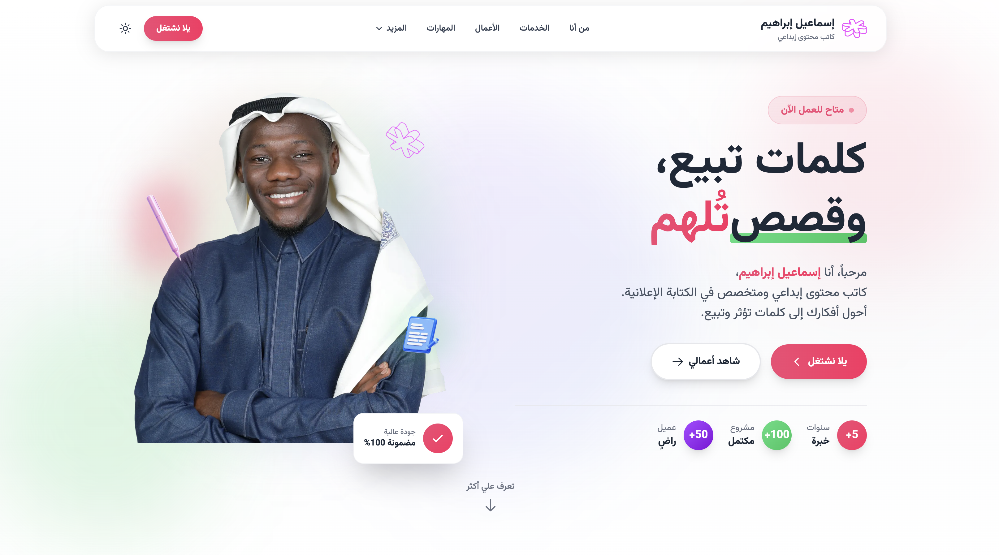
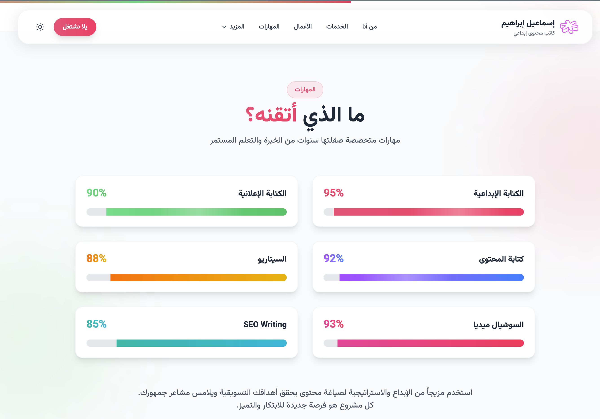

# ✨ Creative Writer Portfolio – Next.js + Tailwind + Framer Motion

A fully animated portfolio website built for a **creative writer**, showcasing services, skills, past work, and contact details through a modern, vibrant UI.  
The project focuses on smooth motion, colorful visuals, and a clean layout that highlights personality and storytelling.

Built using **Next.js**, **Tailwind CSS**, and **Framer Motion** for animations.

---

## 🌟 Preview

## ✨ Features

- Fully responsive Next.js portfolio

- Smooth Framer Motion animations across all sections

- Rich color gradients & creative Arabic typography

- Sections for About, Skills, Services, Work, and Contact

- Language toggle (Arabic + optional English)

- Interactive buttons & hover animations

- Clean component-based structure

- SEO-friendly and fast (Next.js App Router)

## 🛠️ Tech Stack

- Next.js (App Router)

- Tailwind CSS

- Framer Motion

- TypeScript (if used)

- React Icons / Custom SVGs

- Vercel Deployment (optional)

## 💡 What This Project Demonstrates

- Comfort with Next.js structure

- Ability to design polished UI with Tailwind CSS

- Strong animation work with Framer Motion

- Experience building Arabic-first creative websites

- Component architecture & state management

- Production-ready deployment practices

## 📬 Contact

Twitter(X) : [@samuadda](https://x.com/samuadda)

LinkedIn: [Saddiq Musa](https://www.linkedin.com/in/saddiq-daut/)

This project represents my transition from static front-end templates into highly polished, animated, component-driven web experiences using Next.js.
